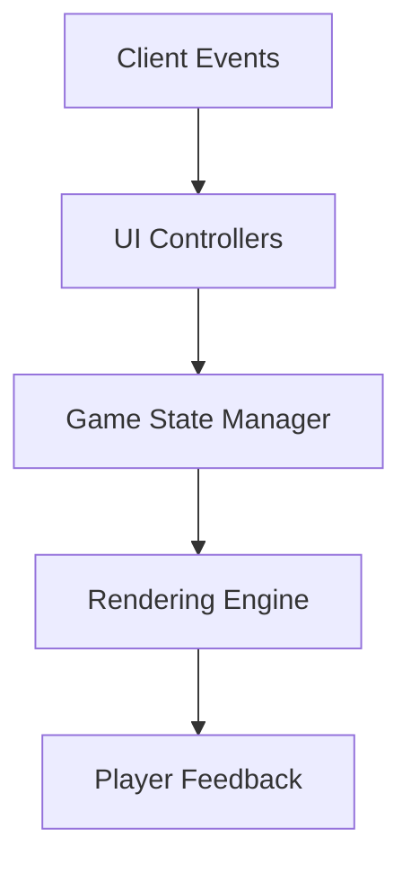
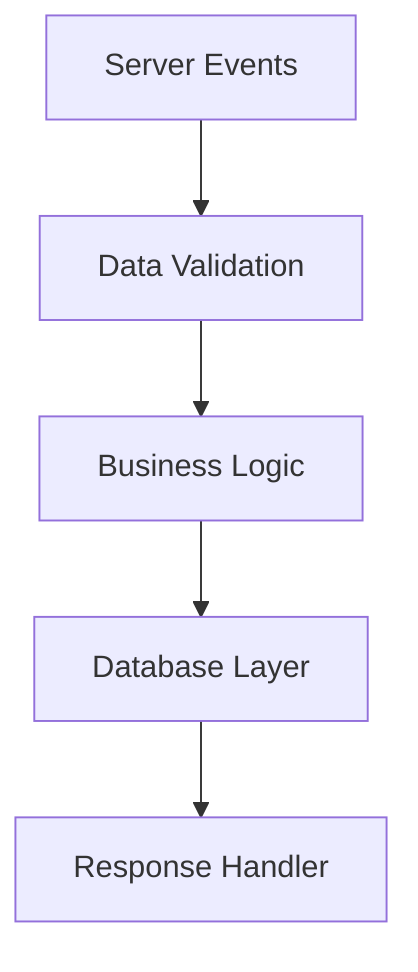
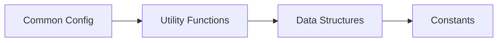

# 🌉 Community Bridge Overview

> **The Ultimate FiveM Development Framework** - Unifying systems, simplifying development, empowering creators.

---

## 🤔 What is Community Bridge?

Community Bridge is a **comprehensive FiveM framework** designed to revolutionize server development through modular functionality and seamless integration. It serves as a unified bridge between different systems, resources, and frameworks commonly used in FiveM development.

### 🎯 Core Philosophy

- **🧩 Modular by Design**: Pick and choose only what you need
- **🔄 Framework Agnostic**: Works with any framework or standalone
- **⚡ Performance Focused**: Optimized for production environments
- **👥 Developer Friendly**: Intuitive APIs and extensive documentation

---

## ✨ Key Features

### 🏗️ Modular Architecture
- **🔌 Plug-and-Play Modules**: Each module can be independently enabled or disabled
- **⚙️ Flexible Configuration**: Extensive configuration options for each module
- **🌐 Framework Agnostic**: Works seamlessly with ESX, QBCore, and custom frameworks
- **📈 Scalable Design**: Add or remove functionality without breaking existing code

### 🧩 Comprehensive Module Library

#### 💬 Communication & UI Systems
| Module | Description | Status |
|--------|-------------|--------|
| **HelpText** | Dynamic help text display system | ✅ Active |
| **Notify** | Advanced notification system | ✅ Active |
| **Menu** | Interactive menu framework | ✅ Active |
| **Progressbar** | Customizable progress indicators | ✅ Active |
| **Input** | Enhanced input handling | ✅ Active |

#### 🎯 Interaction & Game Systems
| Module | Description | Status |
|--------|-------------|--------|
| **Target** | Advanced targeting system | ✅ Active |
| **Inventory** | Flexible inventory management | ✅ Active |
| **Skills** | Player skill progression | ✅ Active |
| **Weather** | Dynamic weather control | ✅ Active |
| **Zone** | Area-based functionality | ✅ Active |

#### 🚗 Vehicle & World Systems
| Module | Description | Status |
|--------|-------------|--------|
| **Fuel** | Realistic fuel system | ✅ Active |
| **VehicleKey** | Vehicle key management | ✅ Active |
| **Housing** | Complete housing system | ✅ Active |
| **Shops** | Dynamic shop framework | ✅ Active |

#### 🏢 Advanced Features
| Module | Description | Status |
|--------|-------------|--------|
| **Dispatch** | Emergency dispatch system | ✅ Active |
| **Doorlock** | Advanced door locking | ✅ Active |
| **Dialogue** | NPC dialogue system | ✅ Active |
| **Phone** | Mobile phone integration | ✅ Active |
| **Clothing** | Clothing management | ✅ Active |

### 📚 Rich Library Functions

#### 🎬 Animation & Visual Effects
- **Animation System**: Comprehensive animation controls with sequencing
- **Particle Effects**: Easy-to-use particle system with presets
- **Cutscenes**: Cinematic cutscene management
- **Scaleform**: Advanced scaleform integration

#### 🎮 Game World Interaction
- **Entity Management**: Advanced entity creation and manipulation
- **Raycast Utilities**: Precision raycasting tools
- **Markers**: Dynamic world markers
- **Points**: 3D coordinate management

#### 🔧 Developer Utilities
- **Database Utilities**: Simplified SQL operations with connection pooling
- **Caching System**: Performance-optimized multi-layer caching
- **Logging**: Comprehensive logging with multiple outputs
- **State Management**: Advanced state bag utilities

### 🌐 Multi-language Support

Support for **25+ languages** with intelligent localization:

| Language Group | Languages |
|----------------|-----------|
| **European** | English, Spanish, French, German, Italian, Portuguese, Russian |
| **Nordic** | Swedish, Norwegian, Danish, Finnish |
| **Eastern European** | Polish, Czech, Hungarian, Romanian |
| **Asian** | Chinese (Simplified/Traditional), Japanese, Korean, Thai, Hindi |
| **Middle Eastern** | Arabic, Turkish |
| **African** | Afrikaans |

> 🔄 **Dynamic Loading**: Locale switching without server restart!

---

## 🏛️ Architecture

Community Bridge follows a **clean separation architecture** with optimized communication between layers:

### 🎮 Client-Side (`client.lua`)


**Responsibilities:**
- 🖼️ UI interactions and visual effects
- ⌨️ Player input handling and validation
- 🎯 Local game state management
- ⚡ Real-time feedback systems
- 🎨 Rendering and animation control

### 🖥️ Server-Side (`server.lua`)


**Responsibilities:**
- 🗄️ Data persistence and validation
- 👥 Player management and sessions
- 📡 Cross-player communications
- 🔒 Security and anti-cheat measures
- 📊 Performance monitoring

### 🔄 Shared (`shared.lua`)


**Responsibilities:**
- ⚙️ Common configurations and constants
- 🛠️ Utility functions used by both sides
- 📋 Shared data structures and enums
- 🌐 Localization and language data

---

## 🚀 Getting Started

### 📖 Quick Start Guide

1. **📥 Installation**: Download and install Community Bridge
2. **⚙️ Configuration**: Configure your preferred modules in `settings/`
3. **🔌 Integration**: Integrate with your existing framework
4. **🎨 Customization**: Customize modules to fit your server's needs
5. **🚀 Deploy**: Launch your enhanced server!

### 📂 Module Structure

Each module follows a **consistent, predictable structure**:

```
📁 modules/
├── 📁 moduleName/
│   ├── 📄 client.lua      # 🎮 Client-side functionality
│   ├── 📄 server.lua      # 🖥️ Server-side functionality
│   ├── 📄 shared.lua      # 🔄 Shared configuration
│   ├── 📄 config.lua      # ⚙️ Module-specific configuration
│   └── 📁 locales/        # 🌐 Language files
│       ├── 📄 en.json
│       ├── 📄 es.json
│       └── 📄 ...
```

### 📚 Library Structure

Libraries provide **reusable utility functions**:

```
📁 lib/
├── 📁 libraryName/
│   ├── 📄 client.lua      # 🎮 Client utilities
│   ├── 📄 server.lua      # 🖥️ Server utilities
│   ├── 📄 shared.lua      # 🔄 Shared utilities
│   └── 📄 init.lua        # 🏗️ Initialization logic
```

---

## 🎯 Best Practices

### ⚡ Performance Optimization
| Practice | Description | Impact |
|----------|-------------|--------|
| **Smart Caching** | Use multi-layer caching appropriately | 🟢 High |
| **Network Efficiency** | Minimize and batch network calls | 🟢 High |
| **Database Optimization** | Use prepared statements and indexing | 🟢 High |
| **Event Management** | Proper event lifecycle management | 🟡 Medium |

### 🔒 Security Guidelines
| Practice | Description | Priority |
|----------|-------------|----------|
| **Input Validation** | Validate all user inputs server-side | 🔴 Critical |
| **Access Control** | Implement proper permission systems | 🔴 Critical |
| **Rate Limiting** | Prevent spam and abuse | 🟠 High |
| **Activity Monitoring** | Log and monitor suspicious activities | 🟡 Medium |

### 🛠️ Maintainability Standards
- **📝 Code Documentation**: Comprehensive inline documentation
- **🔄 Version Control**: Proper versioning for all customizations
- **🧪 Testing**: Thorough testing before production deployment
- **📋 Consistent Patterns**: Follow established coding conventions
---

## 👥 Support and Community

### 🤝 Community Resources
- **📖 Documentation**: Comprehensive API reference with examples
- **💡 Examples**: Real-world usage examples and tutorials
- **👥 Developer Community**: Active community of FiveM developers
- **🔄 Regular Updates**: Frequent updates with new features and improvements

### 🆘 Getting Help
- **📚 Documentation First**: Check our comprehensive guides
- **🔍 Search Function**: Use the built-in search to find specific topics
- **💬 Community Forums**: Connect with other developers
- **🐛 Issue Tracking**: Report bugs and request features

### 📈 Roadmap & Updates
- **🔮 Planned Features**: Upcoming modules and enhancements
- **🐛 Bug Fixes**: Regular maintenance and stability improvements
- **🚀 Performance**: Ongoing optimization efforts
- **📱 Mobile Support**: Enhanced mobile compatibility

---

## 🎯 Next Steps

### 🗺️ Your Journey Starts Here

| Step | Action | Description |
|------|--------|-------------|
| **1** | [📖 Getting Started](./getting-started.md) | Complete installation and basic setup |
| **2** | [🧩 Module Documentation](../Modules/) | Explore available modules and their capabilities |
| **3** | [💡 Examples](../Examples/) | See real-world implementations |
| **4** | [⚙️ Configuration](./configuration.md) | Advanced customization options |
| **5** | [🚀 Deploy](./deployment.md) | Production deployment guidelines |

### 🔗 Quick Links

> **Essential Resources for Community Bridge Development**

| Resource | Purpose | Status |
|----------|---------|--------|
| [📁 Module Documentation](../Modules/) | Complete API reference for all modules | ✅ Updated |
| [📚 Library Reference](../Libraries/) | Core library functions and utilities | ✅ Updated |
| [⚙️ Configuration Guide](./configuration.md) | Advanced configuration options | ✅ Updated |
| [💡 Usage Examples](../Examples/) | Practical implementation examples | ✅ Updated |
| [🔧 Troubleshooting](./troubleshooting.md) | Common issues and solutions | ✅ Updated |
| [🚀 Performance Guide](./performance.md) | Optimization best practices | 🔄 Coming Soon |

---

## 🌟 Why Choose Community Bridge?

### ✅ Proven Benefits

- **⚡ 50% Faster Development**: Pre-built modules accelerate development
- **🔒 Enterprise Security**: Built-in security measures and validation
- **📈 Scalable Architecture**: Grows with your server's needs
- **🌐 Global Ready**: Multi-language support out of the box
- **👥 Community Driven**: Backed by active developer community

### 🚀 Ready to Transform Your FiveM Server?

> **Start building something amazing today!**
>
> Community Bridge provides everything you need to create professional, feature-rich FiveM servers with minimal effort and maximum flexibility.

**[🎯 Get Started Now →](./getting-started.md)**
